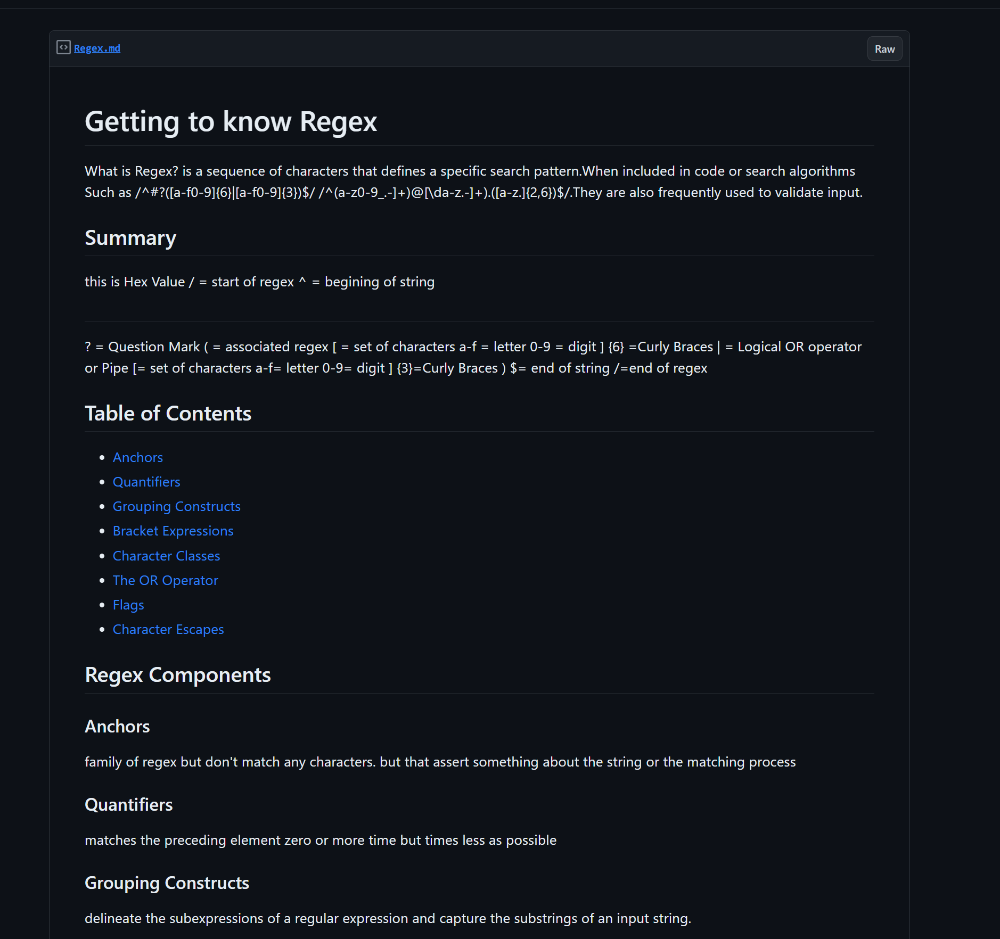
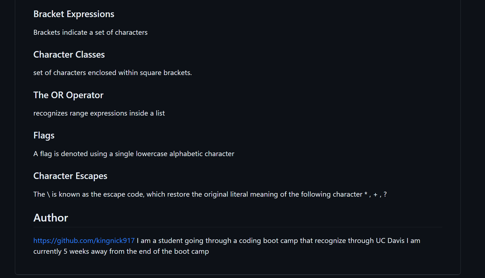

# Regex-Tutorial
This is a tutorial for regex

### Description
This is a tutorial  that semi-explains regex. This application will show you a hex value
And explain it .

### deployed link
https://gist.github.com/kingnick917/33d68d8b55c83fd57091dca24fc50312